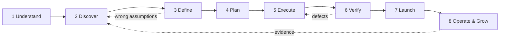

# saas-builder-skills v5

**One front door. One project state. Specialist skills underneath.**

This rewrite changes the pack from an 87-skill stage maze into a project operating system.

The user does **not** choose stages or memorize skill names. They describe what they are building, changing, fixing, launching, or growing. `project-orchestrator` figures out where the project is, what evidence already exists, what is actually relevant, and what to do next.

## The rule

> Draft first. Infer from evidence. Mark assumptions. Ask only when a missing answer would materially change the next move.

No questionnaire marathons. No forcing every project through a funnel. No calculating TAM for a button change. No asking the founder to invent their own USP when the research exists specifically to help discover it.

## The lifecycle



These are **lifecycle phases, not mandatory stages**. The orchestrator may skip, revisit, or run parts in parallel.

Examples:

- New SaaS idea: Understand → Discover → Define → Plan → Execute → Verify → Launch → Operate & Grow.
- Existing feature request: Understand → Define → Plan → Execute → Verify → Launch.
- Existing company website redesign: Understand → Discover current site/audience → Define positioning → Plan IA/UX → Execute site → Verify → Launch.
- Service business: Understand → Discover → Define offer/positioning → Plan delivery + optional marketing funnel → Execute → Verify → Launch.
- Production bug: Understand → Execute diagnosis/fix → Verify → Launch → Operations.
- Funnel work: only enters when the business actually needs a marketing funnel.

## The architecture

### 1. `project-orchestrator` is the front door

It owns the project journey. It:

- identifies project type and current state;
- reads `project.json` before doing anything;
- infers what can be inferred from existing files, code, research, and conversation;
- chooses specialist skills from `registry.json`;
- drafts missing strategic material instead of asking the founder to invent it;
- asks one simple blocking question at a time only when needed;
- writes specialist outputs back to project state;
- updates the project hub;
- recommends and executes the next logical move.

### 2. `project.json` is the source of truth

Every meaningful output becomes structured state, not another disconnected markdown monologue.

It stores:

- identity and project type;
- current lifecycle phase;
- context and direction;
- research/evidence and sources;
- users/jobs/problems;
- positioning, USP candidates, offer and business model;
- requirements, scope, roadmap and architecture;
- UX, funnel and content plans only when relevant;
- build status;
- verification/security/accessibility status;
- launch/operations/growth state;
- assumptions;
- open questions;
- decisions and rationale;
- next actions.

### 3. `hub.html` is a view, not the database

`hub-renderer` turns `project.json` into one founder-facing control panel.

The hub starts with a Dashboard and conditionally shows only relevant sections. A service company does not get empty API-schema panels. An internal tool does not get a sales-funnel altar because somebody numbered it stage three in September.

### 4. Specialist skills are modules

Existing skills remain useful. They no longer define process order.

Examples:

- `market-sizing`, `competitor-teardown`, `underserved-market-finder` support Discover.
- `avatar-extraction`, `offer-extraction`, `unique-value-prop-audit` support Define.
- `prd-writer`, `mvp-feature-slicer`, `architecture-decision-writer` support Plan.
- building skills support Execute.
- testing/security/accessibility skills support Verify.
- Cloudflare/deployment skills support Launch.
- PostHog/growth/operations skills support Operate & Grow.
- funnel/copywriting skills are conditional modules used when acquisition/sales work is relevant.

## Project UX

The expected experience is conversational:

```text
User:
SmartBuzzAI is pivoting into AI cybersecurity.
First service is an AI Use Policy and Shadow AI Risk Review.

Orchestrator:
- opens or creates SmartBuzzAI/project.json
- opens or creates SmartBuzzAI/hub.html
- classifies this as an existing company + new service pivot
- reads existing website/context if available
- researches the market and competitors
- drafts target users, jobs, gaps, positioning candidates and offer assumptions
- updates the hub while it works
- flags assumptions instead of interrogating the user

Orchestrator:
I found a stronger first niche in professional-services SMBs and drafted three positioning directions.
The largest unresolved decision is whether you want the first offer optimized for owner-led firms or MSP/channel partners.
```

That is the intended interaction. The user steers. The system drives.

## Hub sections

The hub is generated from `project.json`. Sections are conditional.

1. Dashboard
2. Project / Company
3. Current Direction
4. Research & Evidence
5. Users, Jobs & Problems
6. Positioning & Differentiation
7. Offer / Business Model
8. Requirements & Scope
9. Roadmap
10. UX / Customer Journey
11. Marketing / Funnel *(only if relevant)*
12. Build
13. Verification, Security & Accessibility
14. Launch
15. Operations & Growth
16. Decisions
17. Assumptions & Open Questions
18. Sources

## What changed from v4

- Retired the idea that folder/stage numbers define the user journey.
- Added a single top-level project orchestrator.
- Added a single project state schema.
- Added a dedicated hub renderer.
- Rewrote `skill-finder` so it reads `registry.json` dynamically instead of embedding a stale copy of the catalog.
- Reframed research as evidence + confidence + recommendation, not an omniscient `GO/PIVOT/KILL` oracle.
- Moved stack selection to planning/build time unless existing technology is already a hard constraint.
- Made positioning/USP generation evidence-driven. The system drafts candidates from research instead of asking users “what makes you different?”
- Made funnels conditional.
- Made security/verification continuous where appropriate, with a hard pre-launch gate.
- Kept local files. No published Artifact requirement.
- Kept a single hub, but made `project.json` the real source of truth so every skill stops knowing how to hand-edit the hub.

## Compatibility

The specialist skill folders from v4 can stay. Their old `metadata.stage` fields are treated as deprecated classification metadata. The v5 orchestrator routes by capability and intent, not stage number.

The included `apply_v5.py` script applies the architecture rewrite to an existing checkout, regenerates `registry.json`, and re-flattens the Claude plugin skill directory.

## Install

After applying the rewrite:

```bash
claude plugin marketplace add Sebastians007/saas-builder-skills
claude plugin install saas-builder-skills@saas-builder-skills
```

Start with plain language. `project-orchestrator` is the front door.
